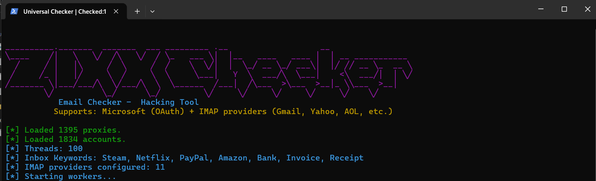

# 🔐 Universal Email Checker (Multi-Provider)

[](LICENSE)
[](https://python.org)
[]()

**A powerful, multi-threaded tool to validate email credentials and search inboxes for keywords.**  
Supports **Microsoft (Outlook/Hotmail/Live)** via native OAuth, plus **all other major providers** (Gmail, Yahoo, AOL, iCloud, Mail.ru, Yandex, GMX, Zoho, ProtonMail Bridge, etc.) via IMAP.

> ⚠️ **Disclaimer:** This tool is for **educational purposes only**. Use only on accounts you own or have explicit permission to test. Unauthorized access violates laws and service terms.

---

## 🚀 Features

| Feature | Description |
|---------|-------------|
| ✅ **Universal Provider Support** | Automatically detects email domain and uses the correct login method. |
| ✅ **Microsoft OAuth** | Native login for Outlook/Hotmail/Live (handles 2FA detection). |
| ✅ **IMAP for others** | Works with Gmail, Yahoo, AOL, iCloud, Mail.ru, Yandex, GMX, Zoho, ProtonMail Bridge, and any custom domain with IMAP. |
| ✅ **Inbox Keyword Search** | Searches for keywords (e.g., "Steam", "Netflix", "Invoice") in email subject/body. |
| ✅ **Proxy Support** | Use HTTP proxies to avoid rate limiting. |
| ✅ **Multi-Threaded** | Configurable thread count (default 100) for high speed. |
| ✅ **Live CPM Display** | Shows **Checks Per Minute** in the console title. |
| ✅ **2FA Detection** | Identifies accounts requiring two‑factor authentication or app passwords. |
| ✅ **Clean Results** | Outputs `/Results/Valid.txt`, `/Results/Inbox.txt`, `/Results/2FA.txt`. |

---

## 📦 Installation

1. **Clone the repository**
   ```bash
   git clone https://github.com/meddhia07/SmtpChecker.git
   cd SmtpChecker